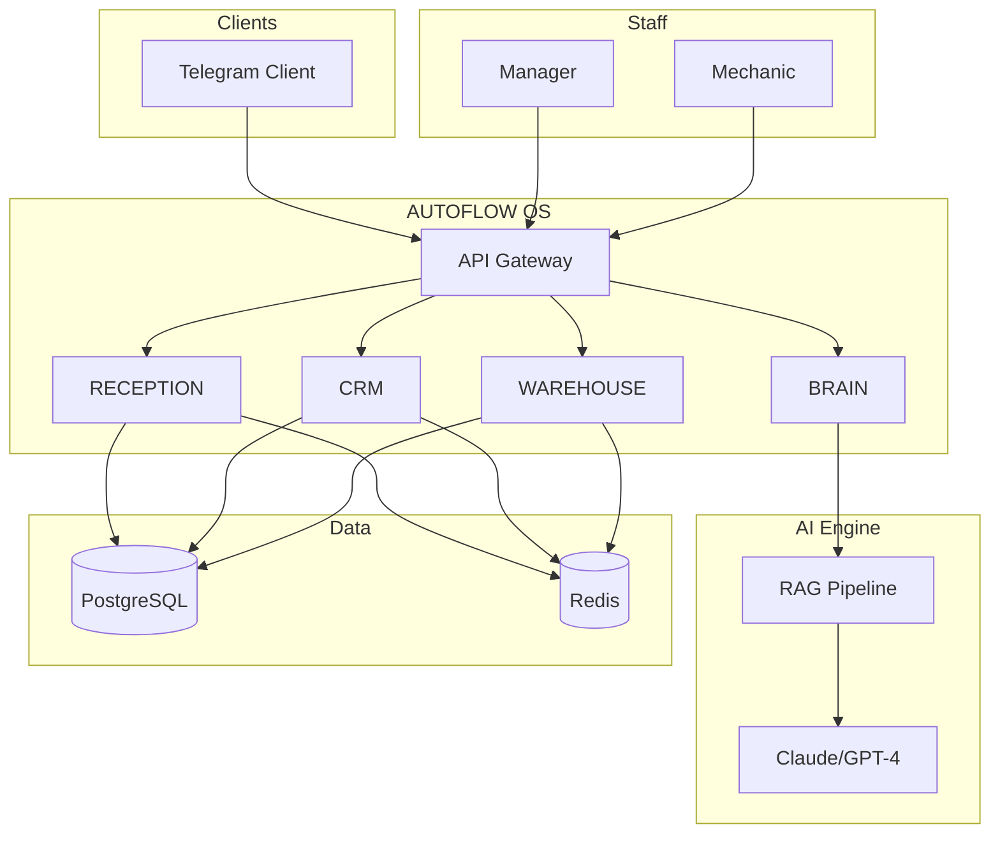

<div align="center">

# 🚛 AUTOFLOW OS

### Intelligent Truck Service Management System

[](https://python.org)
[](https://core.telegram.org/bots)
[](https://openai.com)
[](../LICENSE)

**AUTOFLOW OS** is an AI-powered platform that automates the complete workflow of a truck service center: from initial client qualification to work order closure.

[🇷🇺 Русский](../README.md) • [📖 Documentation](.) • [🚀 Quick Start](#-quick-start)

</div>

---

## 🎯 Problem & Solution

### The Problem

Truck service centers face daily challenges:

| Problem | Impact |
|---------|--------|
| 📞 Missed calls after hours | Up to 30% lost potential clients |
| 🔍 Slow client information lookup | 5-10 minutes per request |
| 📦 Unknown spare parts inventory | Vehicle downtime waiting for parts |
| 🔧 No repair knowledge base | Repeated diagnostics, wasted time |
| 📊 No real-time KPI monitoring | Problems detected too late |

### The Solution

**AUTOFLOW OS** solves these problems through a unified Telegram interface with 5 integrated modules:

- 🎫 **RECEPTION** — 24/7 automated client qualification and booking
- 👥 **CRM** — Instant access to client history and fleet data
- 📦 **WAREHOUSE** — Real-time inventory and cross-reference search
- 🧠 **BRAIN** — AI-powered diagnostic assistant (RAG-based)
- 📊 **ANALYTICS** — Real-time KPI dashboards

---

## ⚡ Key Features

### 🎫 RECEPTION Module

- Conversational problem data collection
- Vehicle make/model identification
- Automatic slot selection
- 1C ERP integration for bookings
- Status notifications

### 👥 CRM Module

- Multi-criteria search (name, phone, plate number, VIN)
- Complete service history
- Fleet management
- Balance & settlements

### 📦 WAREHOUSE Module

- Article/OEM number search
- Real-time inventory across warehouses
- Cross-reference (alternative parts)
- Reservation system

### 🧠 BRAIN Module (AI)

- Knowledge base for 8 truck brands
- OBD/DTC error code interpretation
- Diagnostic recommendations
- Learning from service history

---

## 🏗 Architecture



---

## 🚀 Quick Start

### Requirements

- Python 3.11+
- PostgreSQL 15+
- Redis 7+
- Docker (recommended)

### Docker Installation

```bash
git clone https://github.com/username/autoflow-os.git
cd autoflow-os
cp .env.example .env
docker-compose up -d
```

### Manual Installation

```bash
git clone https://github.com/username/autoflow-os.git
cd autoflow-os
python -m venv venv
source venv/bin/activate
pip install -r requirements.txt
python scripts/init_db.py
python -m src.bot
```

---

## 🛠 Tech Stack

| Category | Technologies |
|----------|-------------|
| **Backend** | Python 3.11, FastAPI, Aiogram 3 |
| **AI/ML** | OpenAI/Claude API, LangChain, ChromaDB |
| **Database** | PostgreSQL 15, Redis 7, SQLAlchemy 2 |
| **Infrastructure** | Docker, Nginx |

---

## 📈 Business Results

| Metric | Before | After | Change |
|--------|:------:|:-----:|:------:|
| Client intake time | 45 min | 25 min | **-44%** |
| Missed requests | 30% | 5% | **-83%** |
| Information lookup | 10 min | 30 sec | **-95%** |
| NPS Score | 6.5 | 8.2 | **+26%** |

---

## 📄 License

MIT License — see [LICENSE](../LICENSE)

---

## 👨‍💻 Author

**Sergey** — Full-Stack Developer & AI Engineer

---

<div align="center">

**⭐ Star this repo if you find it useful!**

</div>
